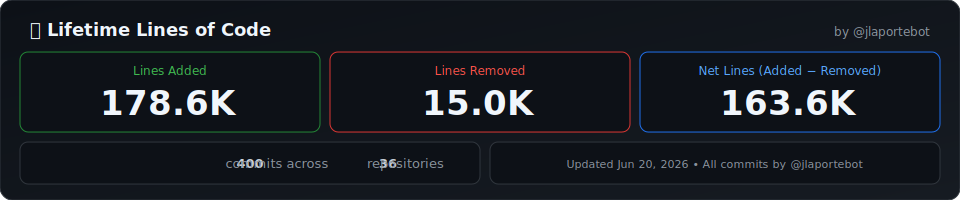

**What this tracks:** Cumulative counts over time
- 🟢 **Repos** — all public repos (owned + forks)
- 🔵 **PRs Opened** — total pull requests submitted
- 🟣 **Open PRs** — currently awaiting review
- 🟠 **Merged** — successfully merged PRs
- 🔴 **Closed** — PRs closed without merge

Auto-updated daily.

---

**What this tracks:** Total lines of code committed across all repositories
- 🟢 **Lines Added** — all insertions across every commit
- 🔴 **Lines Removed** — all deletions across every commit
- 🔵 **Net Lines** — added minus removed (actual code standing)

Updated daily via GitHub Actions. Counts only commits by @jlaportebot.
